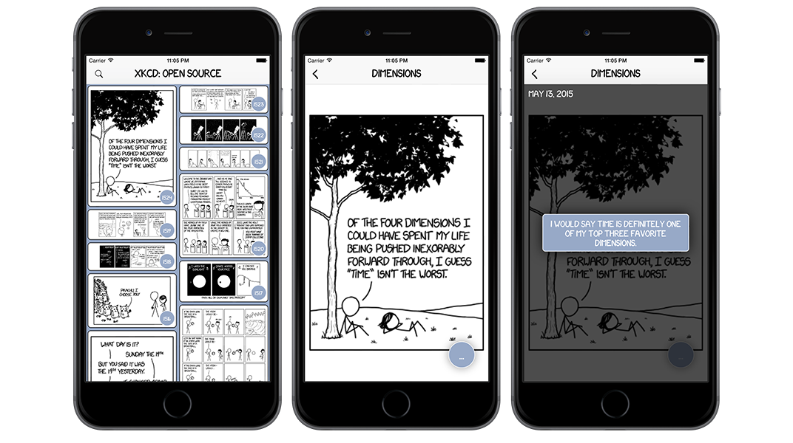

## A free, ad-free, open-source, native, and universal xkcd.com reader for iOS. [Download it from the app store now!](https://itunes.apple.com/us/app/xkcd-open-source/id995811425?mt=8)

## Architecture

- [AFNetworking](https://github.com/AFNetworking/AFNetworking) for networking. *duh*
- [Realm](https://github.com/realm/realm-cocoa) as a data store.
- [Façade](https://github.com/mamaral/Facade) for the UI layout.
- [SDWebImage](https://github.com/rs/SDWebImage) for image downloading / caching.
- [FLAnimatedImage](https://github.com/Flipboard/FLAnimatedImage) for that one GIF.
- [Fabric](https://get.fabric.io/) for beta distribution, analytics, and crash reporting.
- [xkcd-font](https://github.com/ipython/xkcd-font) because obviously.
- Stripped, modified, and customized [Mosaic Layout](https://github.com/betzerra/MosaicLayout) for the comic list.

## Version History
- **v2.5** (Submitted to the App Store)
   - iPhone X support
   - Added support for the four most common languages used by users other than English. German, Simplified Chinese, Spanish, and Russian.
   - Conducted full accessibility audit and implemented improvements.
   - Added 3d-touch previewing of comics from list.
   - New light-weight iOS app rating prompt replaced old alert-view style implementation.
   - Minor bug fixes and improvements
   
- **v2.4**
   - Bookmarking comics - If you enjoy reading all the comics in order, you can bookmark a comic from the comic screen and we've provided an option from the main comic list to be taken back to where you left off at any time.
   - The "alt" view now includes the comic number as well as a "Explain" button that will take you to the explainXKCD site for that comic, in case you'd like a little more context.
   - View All Unread - quickly filter out all viewed comics, seeing only unread comics in the list.
   - Clear Cache - deletes all comics, resets all saved information including 
   - View Bookmarked Comic - As previously mentioned, when you select this menu option you will be taken back to the comic you bookmarked and can continue browsing in-order.
   - View All Comics - this option will return to the unfiltered list if any of the above filters were applied.
   
- **v2.3**
   - Fixes a comic view controller zooming issue caused by zooming in on a comic, viewing the alt text, then moving to the next/prev comic, resulting in the comic being zoomed out too far.
   - Added a Today Widget showing the most recent comic.
   - Removed GTrack and Google Analytics libraries.
   
- **v2.2**
   - Fixes an issue with some of the known interactive comics, using a web view controller instead of the native comic view controller as a stop-gap until we work out some other solution.
   - Ask users to leave a review, only once ever, to get some more feedback.
   - Swipe navigation between comics.
   - Share sheet.
   - Moved alt button to bottom for easier use on larger devices.
   - Random comics can be viewed from the comic list, making it easier to randomly browse.

- **v2.1.1**
   - iOS 9 networking bug fix (https://github.com/mamaral/xkcd-Open-Source/issues/29)

- **v2.1**
   - Share comics to Facebook and Twitter

- **v2.0**
   - Added the ability to favorite a comic, which is indicated on the comic list with a pretty red heart. Along with this, you're able to toggle a filter on the comic list to see only favorites
   - Roll-the-dice to view a random comic
   - Navigate forward and backward through comics directly from the comic view controller
   - Fixed a potential issue with comics not loading on the first launch

- **v1.2**
 	- Visual indication that comics are read vs. unread
 	- Improved comic view layout so some comics won't be cut off by the alt button
 	- *Hopefully* corrected issue related to disappearing push notifications

- **v1.1**
	- Improved scrolling performance
	- Search *beta*
	- Silent push notifications w/ vibration & app badge
	- Bug fixes

- **v1.0**
	- Initial Release - you can read comics and stuff...

## Contributors

- [Yours Truly](https://github.com/mamaral) - Architect of the iOS app.
- [Sean Ferguson](https://github.com/fergusean) - Architect of the server that pulls content from xkcd and pushes to clients.
- [Ryan Copley](https://github.com/RyanCopley) - CI build improvements.

## Want to help?

Download the app and use it - give us feedback! Leave a star on the repo, and a review on the app. If you find any bugs, have any feature requests, or want to say mean and nasty things to me, [open an issue](https://github.com/mamaral/xkcd-Open-Source/issues/new), and if you can patch the bug or add a feature and submit a pull request, even better - just make sure to follow the same code formatting/style and ***BE SURE TO ADD TESTS*** if applicable.

## License / Attribution

The source is made available under the MIT license. See LICENSE.txt for details. For information regarding xkcd licensing, [click here.](http://xkcd.com/license.html)

Social sharing icons from [Zlatko Najdenovski](https://www.iconfinder.com/zlaten) via a [Creative Commons Attribution 3.0 Unported License](http://creativecommons.org/licenses/by/3.0/).
