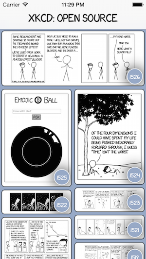
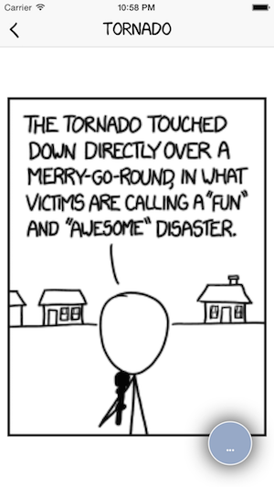
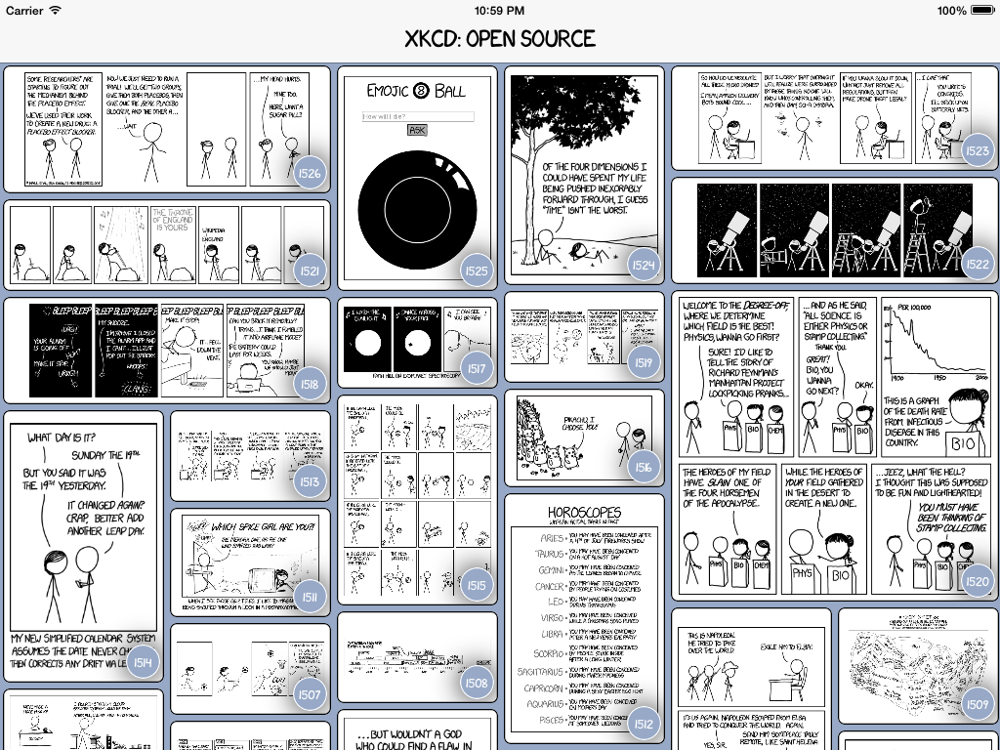

## A free, ad-free, open-source, native, and universal xkcd.com reader for iOS.

# Features include:

- Notifications when new comics are released
- GMOs
- Increased meta
- Optimized electron-per-pixel count
- Quantum entanglement
- The most skeptical algorithms
- Pizza

## Architecture

- [AFNetworking](https://github.com/AFNetworking/AFNetworking) for networking. *duh*
- [Realm](https://github.com/realm/realm-cocoa) as a data store.
- [Façade](https://github.com/mamaral/Facade) for the UI layout.
- [GTrack](https://github.com/gemr/GTrack) for interfacing with Google Analytics.
- [SDWebImage](https://github.com/rs/SDWebImage) for image downloading / caching.
- [FLAnimatedImage](https://github.com/Flipboard/FLAnimatedImage) for that one GIF.
- [Crashlytics](https://try.crashlytics.com/) for beta distribution, analytics, and crash reporting.
- [xkcd-font](https://github.com/ipython/xkcd-font) because obviously.
- Stripped, modified, and customized [Mosaic Layout](https://github.com/betzerra/MosaicLayout) for the comic list.

## Todo List (in no specific order)

- [ ] Gathering user feedback
- [ ] Searching
- [ ] Favoriting
- [ ] Visual indication that comics are read/unread
- [ ] Lazy-image downloading for offline viewing
- [ ] Social sharing
- [ ] Investigate integrating the ***What If?*** series
- [ ] ***About*** section featuring contributors
- [ ] Code coverage
- [ ] Getting Randall Munroe to acknowledge my existence

## Want to help?

Download the app and use it - give us feedback! Leave a star on the repo, and a review on the app. If you find any bugs, have any feature requests, or want to say mean and nasty things to me, [open an issue](https://github.com/mamaral/xkcd-Open-Source/issues/new), and if you can patch the bug or add a feature and submit a pull request, even better - just make sure to follow the same code formatting/style please.

## License

The source is made available under the MIT license. See LICENSE.txt for details. For information regarding xkcd licensing, [click here.](http://xkcd.com/license.html)
